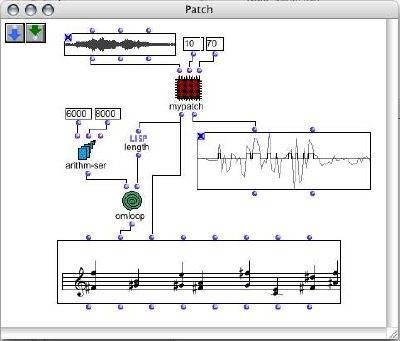

OpenMusic (OM) is a visual programming language based on [Lisp](http://www.gigamonkeys.com/book/introduction-why-lisp.html). Visual programs are created by assembling and connecting icons representing functions and data structures. Most programming and operations are performed by dragging an icon from a particular place and dropping it to an other place. Built-in visual control structures (e.g. loops) are provided, that interface with Lisp ones.

OM may be used as a general purpose functional/object/visual programming language. At a more specialized level, a set of provided classes and libraries make it a very convenient environment for music composition. Above the OpenMusic kernel, live the OpenMusic Projects. A project is a specialized set of classes and methods written in Lisp, accessible and visualisable in the OM environment. Various classes implementing musical data / behaviour are provided. They are associated with graphical editors and may be extended by the user to meet specific needs. Different representations of a musical process are handled, among which common notation, midi piano-roll, sound signal. High level in-time organisation of the music material is proposed through the concept of "maquette".

Existing CommonLisp/CLOS code can easily be used in OM, and new code can be developed in a visual way.

---------

Designed and developed by the IRCAM [Music Representation research group](http://repmus.ircam.fr) 
© 1998 - 2018 Carlos Agon, Gérard Assayag, Jean Bresson.

