# Score Segmentation and Analysis in OM (6.6 and higher)

Since v.6.6 OM provides a framework for sound segmentation an analysis integrated in the musical objects architecture.


> **Read the full paper:** J. Bresson, J., C. Pérez Sancho, [New Framework for Score Segmentation and Analysis in OpenMusic](https://hal.archives-ouvertes.fr/hal-01161435). Sound and Music Computing conference (SMC), 2012.

 
## Introduction 

This frameworks builds on few simple concepts:

#### Analysis 
* An analysis model is represented by a _class_, subclass of the general class `abstract-abnalysis`.
* Every musical object can be attached one or several instances of the analysis, or of different types of analyses.

=> In order to define an analysis to be integrated in OM, just define your own class : 

```cl
(defclass my-analysis (abstract-analysis) ())
```

#### Segments

  * An analysis basically contains set of one or more **segments** associated to a score object (stored as a list in a slot called `analysis-segments`).
  * A segment define any part of the score, following arbitrary (temporal, structural, manual...) criteria.
  * Segments are all instances of any subclass of the general superclass `segment`.
  * A number of predefined segment classes are provided (`chord-segment`, `time-segment`, etc. -- see table below)
  * Segments can embed some information related to the analysis in their slot `segment-data`. 

Predefined subclasses and attributes:

| class name | attributes | description |
| --- | --- | --- |
| TIME-SEGMENT  	| t1, t2 | segment defined between to times (_t1_ and _t2_) |
| MARKER-SEGMENT 	| t | simple marker at time _t_ | 
| CHORD-SEGMENT	| index-list | segment containing the chord(s) whose index are in _index-list_ |
| MEASURE-SEGMENT	| index-list | segment containing the measure(s) whose index are in _index-list_|
| CHORD-MARKER	| chord-index | marker at chord #_chord-index_ (the marker may implicitly define the segment up to the next marker) |
| PROPERTY-SEGMENT	| test-function | segment defined by a property (any score element complying with the property is implicitly included in the segment)|

#### Architecture

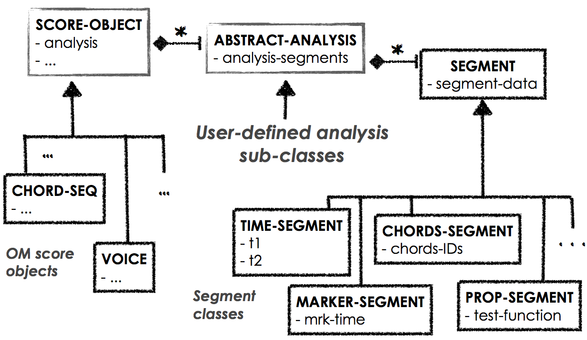

## Programmer Interface

A relatively simple programmer interface allows to create or call the relevant analysis procedures, or define particular behaviors for the interactions and display of the analysis in the score editors.

#### Segments API
These function may be redefined in the case of using user-specific segment classes.

| function name | attributes | description | expected return values/types |
| --- | --- | --- | --- |
|`segment-begin` |segment| _beginning time of the segment_ | number |
|`segment-end` |segment | _end time of the segment_ | number |
|`segment-init` |segment | _called at segment creation_ | - |
|`segment-update` |segment, object| _called when the 'object' is modified_ | - |
|`draw-segment`  |segment, view| _draws the segment in the score editor (view)_ | - | 
|`segment-clicked-p` |segment, view, position| _is the segment selected by a click at 'position'?_ | T or NIL |

####  Analysis API

These functions shall be redefined depending on the features and interface of the analysis class.

| function name | attributes | description | expected return values/types |
| --- | --- | --- | --- |
|`default-segment-class`|analysis| _the type of segments used for this analysis_|symbol (class name)|
|`compatible-analysis-p` |analysis,object|_compatibility of the analysis with different classes of score objects_|T or NIL|
|`analysis-init` |analysis,object| _called when the analysis is attached to object_| - |

These functions will affect and activate the available options in the menus etc:

|`compute-segments-p` | analysis | _is analysis capable of computing segments_ | T or NIL |
|`analyse-segments-p` | analysis | _can analysis analyze a list of existing segments_ | T or NIL |
|`compute+analyse-segments-p` | analysis | _can analysis run both operations at a time_ | T or NIL |
		
Main analysis procedures:

|`compute-analysis-segments`|analysis,object|_the segmentation process_ | a list of _segment_ instances |
|`analyse-one-segment`|analysis,segment,object|_analysis of one segment: sets something in segment-data_| - |

Segment specific processing :

|`analysis-init-segment`  | analysis,segment | _called when segment is added to analysis_ | - |
|`delete-from-analysis` | analysis,segment | _called when user removes a segment_ | - |

Display :

|`segment-data-tostring` |analysis, segment | _a simple display for the segment data_ | string |
|`draw-segment-data` | analysis, segment, view | _personalize the drawing of the segment data on view_ | - |

User events callbacks:

|`analysis-key-event` |analysis, view, key | _defines personalized actions for keyboard events_ | - |
|`analysis-add-click` |analysis, view, key | _defines personalized action for add-click _ | - |
|`handle-segment-click` |analysis, segment, view, position | _called when a segment is clicked_ | - |
|`handle-segment-doubleclick` |analysis, segment, view, position | _called when a segment is double-clicked_ | - |

Segment creation callbacks:

|`segment-handle-add-click` | segment, analysis, view, position| _called when a segment is created in this analysis by a mouse click_ | a _segment_|
|`segment-handle-add-key` |segment, analysis, view|_called when a segment is created in this analysis with key 's'_| a _segment_|

## How does it work ?

### 1) The 'segmentation' mode

In the score editor (chord-seq, voice), select **Segmentation** in the présentation modes (menu "Présentation" or contextual menu).

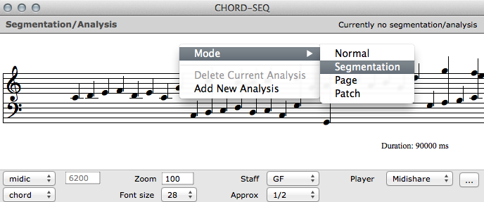

You have now two options in the contextual menu:
  * Add new analysis
  * Delete current analysis

Since you don't have any attached analysis yet, you can try "Add new analysis" and try to attach one of the available analyses (if any).

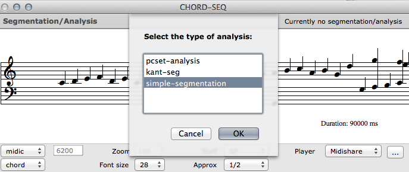


In principle **simple-segmentation** is the only default analysis in OM.     
Additional analysis may be loaded in other projects, libraries, or in your own source code.

**simple-segmentation** does nothing in particular: it just allows you to set markers (_marker-segment_) at some positions in your score (cmd+click).      
(user-defined subclasses may propose more advanced features).

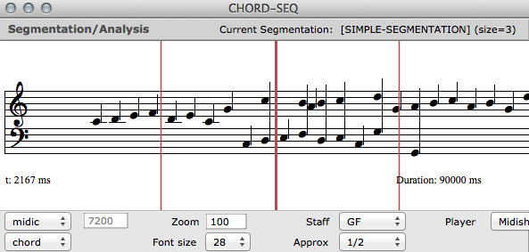

At the top of the editor window you can see that your current segmentation is a **simple-segmentation** containing 3 segments (in this particular case, markers).

If several analysis's are attached to a same score object, switch between them using the TAB key.

Now that we have analysis in our editor, we can also notice that the contextual menu proposes additional (not necessarily enabled) options, such as _Rename Analysis_, _Reset Analysis_ (removes all the segments), etc.

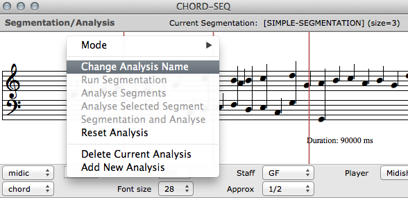

### 2) Interacting with segmentation / analysis data

Default segments and markers can be selected (mouse click) and eventually removed (delete key), analyzed or reanalyzed (when these options are available in the analysis).

After a quick look at the [architecture](analysis#architecture) of our framework, we can easily access the analyses, segments and their internal data in our OM patches for further processing.

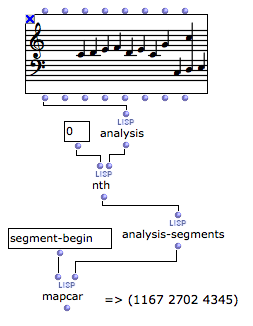


## Let's define our own analysis

In order to illustrate the process of defining an analysis, let's look at the example of the predefined analysis **pcset-analysis**. This analysis allows to select chords or groups of chors in the score and collect or display their representation as a **n-cercle** object, that is, their pitch class set representation.

#### Definition of the class:

```cl
(in-package :om)

(defclass! PCSET-ANALYSIS (ABSTRACT-ANALYSIS) ())
```

Once this simple definition is evaluated (and if the type of object conforms with the analysis), **pcset-analysis** becomes available among the proposed analyses for the "Add new analysis" action.

#### Segmentation

The main segmentation function is `compute-analysis-segments`. If we want to define it (that is, to allow our analysis to make the segmentation iself), we need to define it. To keep things simple, let's say that our default segmentation process takes each chord as an individual segment. The class `chord-segment` defines the segment with a list containing the chord(s) id(s) (positions in the sequence):    


```cl
(defmethod compute-analysis-segments ((self pcset-analysis) (object t)) 
  (loop for c in (get-real-chords object)
        for i = 0 then (+ i 1) collect
          (make-instance 'chord-segment
                         :chord-ids (list i)
                         :color (om-random-color)
           )
    ))
```

If we want the segmentation process to be enabled in the cotextal menu of the segmentation mode, we now need to defined the following method :

```cl
(defmethod compute-segments-p ((self pcset-analysis)) t)
```

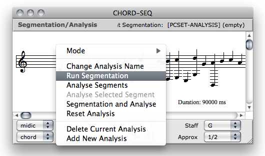  =>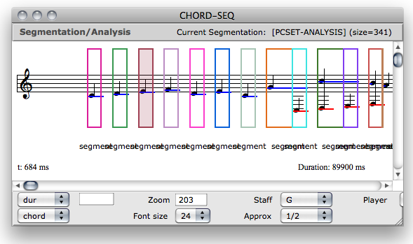

Note that you can reset the segmentation an analysis anytime using the contextual menu item "Rest Analysis".     
Individual segments can also be selected and deleted using the standard 'remove' keys.

#### Manual segmentation

Depending on the analysis process, it might be important to let the user define of modify the segmentation.
This can be more or less easy depending on the type of the segment used in the analysis.

At the more general level, one can choose to redefine functions of the API such as `analysis-key-event` (called when a user presses a key on the editor), `analysis-add-click` (called when the editor "cmd-clicks", generally with the intention to "add" something following the OM standards), or `handle-segment-doubleclick` (called when the user double clicks somewhere on the editor) -- all this, only in the "segmentation" mode of the editor.

The standard (predefined) case is that the analysis will "try" to create a segment at "add-clicking" or pressing 's' key. In this case, you can define a personalized behavior by redefining the method `segment-handle-add-click` or `segment-handle-add-key` so that it returns a segment of the desired class and correctly initialized.

The set of predefined segment classes generally have such features already implemented. 
In order to benefit from these features, we just need to specify that our analysis will use segments of a given class, so that the correct and predefined `segment-handle-...` will be called accordingly : 

```cl
(defmethod default-segment-class ((self pcset-analysis)) 'chord-segment)
```

It is now possible to add a segment in our segmentation by selecting a group of chords with the mouse and pressing 's'.

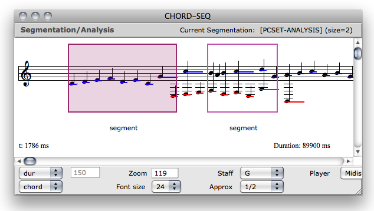

> Note that `chord-segment` also have a number of other features implemented : for instance the drawing or selection method when you click on the segment area (which you can redefine using methods from the segments API, respectively, `draw-segment` and `segment-clicked-p`).

#### Analysis

The main method to define in order to implement our analysis process is `analyse-one-segment`. This method is supposed to set the contents of the segment's `segment-data` slot depending on the associated score data. We use the method `chord2c` from the OM _MathTools_ library in order to create our **n-cercle** object from the pitches of the segment's chords (note that `chord-segment` has a slot chord allowing to directly access the chord instances instead of retrieving them with the list of chord-ids).

```cl
(defmethod analyse-one-segment ((self pcset-analysis) (seg segment) (object t))
  (setf (segment-data seg) 
        (chord2c (make-instance 'chord 
                                :lmidic (apply 'append (mapcar 'lmidic (chords seg))))
                 2)))
```

We can now notify the system the availability of the analysis process : 

```cl
(defmethod analyse-segments-p ((self pcset-analysis)) nil)
```

Two new options will then be available in the contextual menu : "Analyse segments", and "Analyse selected segment" (if a segment is selected).

We can eventually enable as well the possibility to run directly the segmentation and analysis of the score :

```cl
(defmethod compute+analyse-segments-p ((self pcset-analysis)) t)
```

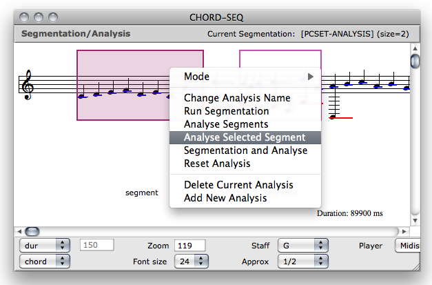

#### Display

The function `segment-data-tostring` allows to print the segment's analysis contents in the editor. It just needs to return a string and can be specialized for the analysis type :

```cl
(defmethod segment-data-tostring ((self pcset-analysis) segment)
  (if (segment-data segment)
      (format nil "~A" (car (puntos (segment-data segment))))
    ""))
```

For more advanced display, the method `draw-segment-data` allows to display the contents using the OM graphics APIs:

```cl
(defmethod draw-segment-data ((self pcset-analysis) segment view) 
  (let* ((x1 (time-to-pixels view (segment-begin segment)))
         (x2 (time-to-pixels view (segment-end segment)))
         (mid (round (+ x1 x2) 2))
         (cr 40)) 
  (om-with-font *om-default-font1*
       (when (segment-data segment)
               (draw-cercle (segment-data segment) view 
                            mid (- (h view) 120) 
                            cr
                            2 3 t 0))
       (om-draw-string (- mid (round (om-string-size (segment-data-tostring self segment) *om-default-font1*) 2))
                       (- (h view) 60)
                       (segment-data-tostring self segment)))))
```

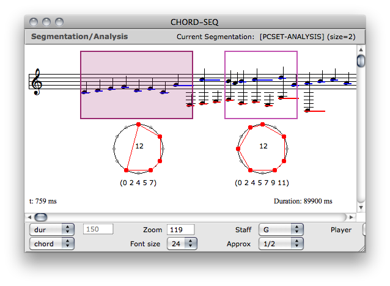


## Where can I find analyses ?

In addition to the **simple-segmentation** OM embeds the pith class set analysis (**pcset-analysis**) from the previous section, as well as a simple prototype of quantification (**kant-seg**).

The _[harmonic-analysis](http://grfia.dlsi.ua.es/cm/projects/drims/software.php)_ library proposes an additional interactive framework for score analysis.
