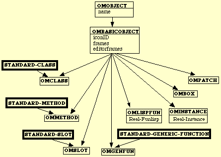
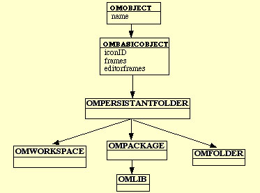
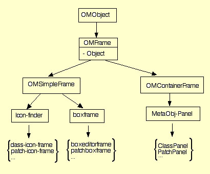
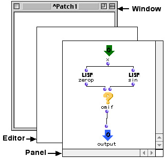
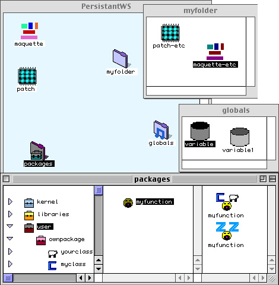

# OM Architecture

Below are detailed some important OM concepts.

> **Note:** The follow sections are adapted from the OM 4 developer documentation an may contain some outdated information (class names, etc.)

## Meta-Objects

OM can be regarded as an extension of CLOS using its Meta Object Protocol. This involves basically the possibility of subclassing meta-object's classes (such as standard-class, the class which instances are themselves classes) and then defining new methods for the subclass. The next figure shows the hierarchy of OM meta-object classes. CLOS meta-object classes are represented by a bold framed rectangle.



Every object in OM has a name (inherited from the `OMObject` class). 
Meta-objects classes in OM are subclasses of `OMBasicObject`.

There are two main types of meta-objects in OM :

- Langage meta-objects
- Environnment meta-objects


### 1 Language meta-objects

Langage meta-object are basic entities used for programmation.
Langage meta-objects can be divided in two groups.

- CLOS equivalent meta-object classes
- OM peculiar meta-object classes

#### 1.1 CLOS equivalent meta-object classes:

`OMStandardClass`, `OMSlot`, `OMGenericFunction`, `OMMethod`, `OMLispFun`, `OMBasicType`.


We use the multiple inheritance in order to define most of this classes, for example `OMGenericFunction` inherits from the CLOS class `standard-generic-function` and the OM class `OMBasicObject`.


```cl
    (defclass OMGenericFunction (standard-generic-function OMBasicObject)
      ((numouts :initform nil :accessor numouts)
       (inputs-default :initform nil :accessor inputs-default)
       (lib-fun-p :initform nil :accessor lib-fun-p)
       (inputs-doc :initform nil :accessor inputs-doc)
       (inputs-menus :initform nil :accessor inputs-menus))
      (:metaclass OMStandardClass))
```


All meta-object classes have `OMstandardClass` as metaclass and not `standard-class`, this feature allows us to see all meta-objects as simple OM instances.

The `OMStandardClass` inherits from (and have as meta-class) the class `OMClass` :

```cl
    (defclass OMstandardClass (OMClass) ( )
      (:metaclass OMClass))
```

`OMClass` class is defined as the other meta-objects, but its meta-class is `standard-class` so the default CLOS meta-class:

```cl
    (defclass OMClass (standard-class OMPersistantObject)
      ((lib-class-p :initform nil :accessor lib-class-p)
       (internal-met :initform nil :accessor internal-met)))
```

Exceptions of the previous mechanism are :

  * `OMBasicType`, because we can not inherit from built-in classes.
  * `OMLispFun`, because there is no defined CLOS protocol for Lisp function.

For the last two classes the technique of delegation instead of multiple inheritance is used.


#### 1.2 OM peculiar meta-object classes:

The OM class list for the basic entities involved in programmation are:

`OMPatch`, `OMMaquette`, `OMInstance`, `OMBox`.

Patches are instances of the `OMPatch` class, the meta-class of this class is `OMStandardClass`:

```cl
    (defclass OMPatch (OMBasicObject)
      ((boxes :initform nil :initarg :boxes :accessor boxes)
         ...)
      (:metaclass OMStandardClass))
```

Maquettes are instances of the `OMMaquette` class. This class is a subclass of `OMPatch`. Maquettes and Patches are principaly defined by a list of boxes, this list is stored in the slot called `boxes`.

Boxes are instances of the OMBox class. Because boxes are important meta-objects in OM we dedicate a special section [Boxes](architecture#boxes).

`OMinstance` instances allow us to visualisize instances of `OMStandardClass` classes. We use delegation to point to the real CLOS instance:

```cl
    (defclass OMInstance (OMBasicObject)
      ((instance :initform nil :initarg :instancor :accessor instance)
        ...))
```

### 2 - Environnement meta-objects

We list here the basic meta-objects used in the environment :

`OMWorkspace`, `OMFolder`, `OMPackage`, `OMLib`.

All these classes inherit from the `OMBasicObject` class.




## Boxes

The more general class for boxes is `OMBox`, which inherits from `OMBasicObject` and has `OMStandardClass` as metaclass:

```cl
(defclass OMBox (OMBasicObject)
  ((reference :initform nil :initarg :reference :accessor reference)
    ...)
 (:metaclass OMStandardClass))
```

There exist two main subclasses of OMBox: `OMBoxClass` and `OMBoxCall`.

`OMBoxClass` is the class for boxes in a hierarchical tree, connections between these boxes represent inheritance.


`OMBoxCall` is the class for boxes in a patch, connections between these boxes represent the functional composition. In accordance to the value of the slot reference there exist different subclasses of boxes in a patch. This is a list with the principal types of boxes:

| Reference | Box Class |  
|---|---|  
| Generic Function | OMBoxCall |
| Lisp Function | OMBoxLispCall |
| Patch | OMBoxPatch|
| Maquette  | OMBoxMaquette|
| Class | OMBoxRelatedClass|
| OMBasicType | OMBoxTypeCall|
| ... | ... |


A special subclass of box is `TemporalBox`, which is the class for boxes in a maquette.


## Graphic Visualization


All OM meta-objects can be visualized in one of two ways, either as a _SimpleFrame_ or as a _ContainerFrame_. 
A _ContainerFrame_ is an instance of class `OMContainerFrame` and a _SimpleFrame_ is an instance of the class `OMSimpleFrame`.

These two classes are subclasses of `OMFrame`.

OMFrames have a slot called `object` that points to the meta-object which they visualize.




### 1 - Simple frames

There are two main types of SimpleFrames:

* **icon-finder**
* **boxframe**

#### 1.1 - Icon-finder

Icon-finder is the most general class to visualize meta-objects in the Mac finder way (i.e. an icon + a name). There is a specific subclass of icon-finder for each meta-object, for exemple for an `OMClass` the icon-finder is an instance of the `class-icon-frame` class.

The generic function `get-class-icon` (OMMeta-object => OMSimpleFrame) returns the `omsimpleframe` class for each meta-object.


#### 1.2 - BoxFrame

It is the most general class for simple visualization of boxes. For each different class of box, there exists a method `get-frame-class` (OMBox => boxframe) which choose the class of `boxframe` asociated with the class.

A special subclass of boxframe is `TempObjFrame` which is the class frame for temporal boxes in a maquette.


### 2 - Container frames

Container frames are subclasses of `MetaObj-Panel` (subclass of `OMContainerFrame`). In our model an object is composed by a set of elements together with (optionally) a relation over them. A _class_ object, for example, is composed of an ordered list of _slots_, a _generic function_ consists of a set of _methods_, a _patch_ contains a list of _boxes_, etc. 
So the container frame of a meta-object is composed by a set of simple frames referencing the elements of the meta-object. A double-click event on a _simple frame_ opens the _container frame_ of the meta-object by calling the genereric function ù`OpenEditorObject` with the object slot of the _simpleFrame_ as an argument.

`OpenEditorObject` looks for the specific class of the _containerFrame_ (see the next sectionabout metaobject's editors for more information about this mechanism).

Each meta-object has a class of associated container. 
Here are the principal subclasses of MetaObj-Panel:

|MetaObject Class | Panel Class |
| --- | --- |
|OMPatch |PatchPanel |
|OMClass |ClassPanel |
|OMMethod |MethodPanel |
|OMWorkSpace |WorkspacePanel |
|OMFolder |FolderPanel |
|OMGenericFunction |GenericFunPanel |
|... |... |


## Metaobject Editors

Meta-object containerframes are open in separate windows. The next figure show the main subviews of these windows:



Every editor window in OM is instance of the `EditorWindow` class. For each metaobject there is a class of editor inheriting from the general class `metaobj-Editor`.

For example, for a `OMPatch` the editor class is `PatchEditor`; for a `OMFolder` the class is `FolderEditor`, etc. 

The function `get-editor-class` (OMBasicObject => metaobj-Editor) returns the class name of the associated metaobject's editor.


Editors do not containt simple frames, they are contained in the panel. _Editors_ are associated to a metaobject, so they are subclasses of `OMsimpleFrame` class whereas _panel_ are subclasses of `OMcontainerFrame`.


For each metaobject's editor there is a panel class associated. This panel class is a subclass of `metaobj-Panel`.
For example, for `ClassEditor` the panel class is `ClassPanel`; for `MethodEditor` the panel class is `MethodPanel`, etc.


The function `get-editor-panel-class` (metaobj-Editor => metaobj-Panel) returns the class name of the panel associated to an editor.


When you double-click on a patch icon for example, the function `OpenObjectEditor` is invoked ; this function verifies if a editor is already open, and if it is not the case it invokes the function `OpenEditorFrame` specialized by the metaobject (_patch_, in this case).


`OpeneditorFrame` makes an instance of EditorWindow and creates it an editor and a panel in it. Then for each element (e.g. boxes in a patch) of the metaobject, a simple frame is created and included in the panel. Finally the panel is assigned to the slot `editorFrame` of the metaobject.


Window's events are delegated to the editor subview. Other window's methods invoked by the menu commands are delegated to the editor too.

`metaobj-editor` is a subclass of the class `editorview`. Editors for instance of a `omstandardclass` like `note`, `bpf`, etc. inherit also from `editorview`. This feature plus the fact that metaobjects are omsantardclasses instead of standard-classes allow us to use factories of metaobjects in a patch.

The page [Class Protocol](classprotocol) explains how to define editors for factories.


## OM Protocol

Like most graphic environments OM is based on the event notion. Windows are the local context at a given instant. Each window translates events (mouse-click, drag&drop, etc...) into specific actions on the graphic frames. Graphic frames invoke a specific method of the metaobject that it visualises. We call protocol the set of methods for the metaobjects. Here is a list with the principal methods of the protocol:


  * `get-elements`
  * `omg-add-element`
  * `omg-remove-element`
  * `omg-change-container`
  * `omg-rename`
  * `omg-select`
  * `omg-unselect`
  * `omgmoveobject`
  * `omng-box-value`

Event clicks and traditional events are handled using the MCL-based methods: `view-click-event-handler`, `view-key-event-handler`, `window-zoom-event-handler`, etc.

Drag&drop is the main user interface tool in OM. This is defined as an action between a _dragged OMFrame_ and a _target OMFrame_. This results in the invocation of a generic function belonging to the protocol. We are going to illustrate this mechanism in the next section with the help of one method of the protocol.


## Drag and Drop 

Drag&drop is defined as an action between a _dragged OMSimpleFrame_ and a _target OMContainerFrame_.
Dragged and target views are instances of a subclass of `om-view-d-d`.


Suppose us that we want to add a slot of type `note` to an existing class **A**. For this we must drag a `class-icon-frame` (with the class `note` in its slot object) and drop it into a `ClassPanel` (with the class **A** in its slot object). Starting a drag action invokes the method `om-drag-start` with the `class-icon-frame` as argument. This method fill the slots of the global variable `*OM-drag&drop-handler*` with the information about the drag step. (`*OM-drag&drop-handler*`
is an instance of the `omdrag-drop` class.)

When the `class-icon-frame` is dropped on the panel the method `om-drag-receive` is invoked with the ClassPanel as principal argument. This method complete fill slots of `*OM-drag&drop-handler*` with information about the drop step and then call the method `finalize-drag&drop` with `*OM-drag&drop-handler*` as argument. This method test if it is posible to drop the slot object of the `class-icon-frame` into the slot object of the `ClassPanel` ; for this there is a genreic function called `drop-allow-p` specified for differentes metaobjects ; in our exemple it is possible if the class **A** is not protected.


```cl
(defmethod drop-allow-p ((D&DHandler omdrag-drop) (dragged OMClass) (target OMClass))
  (if (protected-p target)
    (om-beep-msg "This class is protected you can not add slot to it")
 t))
```

If the operation is allowed the method perform-drop is called with arguments `*OM-drag&drop-handler*` `dragged` and `target`.

```cl
(defmethod perform-drop ((D&DHandler omdrag-drop) (dragged class-icon-frame) (target ClassPanel) position)
  (make-add-slot target (class-name (object dragged)) position))
```

Finally the make-add-slot call the method `omg-add-element` of the protocol with arguments <I>A</I> (the class to modify) and a new instance of the class OMSlot.

Other OM operations such as move, remove, copy, etc. work in the same way.


## Persistence


The `OMPersistantObject` class is the superclass for all meta-objects which are saved on the disk.

```cl
(defclass OMPersistantObject (OMBasicObject)
  ((mypathname :initform nil :initarg :mypathname :accessor mypathname)
   (omversion :initform *om-version* :accessor omversion)
     ...)  
```

Principal subclasses of OMPersistantObject are: 

`OMWorkSpace`, `OMFolder`, `OMPackage`, `OMlib`, `OMPatch`, `OMMaquette`, `OMinstance`, `OMMethod`, `OMClass`.


The generic function `omng-save` is specialized for all meta-objects, it is responsible to write on disk graphical objects created by the user.

```cl
 (defgeneric omNG-save (self &optional values?))
```

### Saving WorkSpaces

In order to explain how a workspace is stored on the disk, let's take the example illustrated in the next figure:



When you launch OM and choose a WorkSpace, a current workspace instance of OMWorkSpace is created and its slot `mypathname` is set to the pathname of the associated folder.

A Workspace folder contains 3 main folders and a few additional files:

* Folders
  * **elements**: Store patches, maquettes and subfodlers.
  * **globals**: Store global variables.
  * **user**: Store classes, methods and subpackages of the user package.
* Files : _preferences.lisp_, _userpackage.lisp_, _wsparams.lisp_.

An optional file called _modifs.lisp_ can be added to a workspace. It must contain some lisp code that will be automatically loaded with that workspace.


Then saving a workspace consists basically of:
* Saving patches, maquettes and folers in the elements folder
* Saving instances in the global folder
* Saving classes and methods in the user packages.


### Saving patches 

Patches (and maquettes) have each an associated file , it is determinated by the pathname stored in the slot `mypathname`. This pathname is relative to the WorkSpace containing the patch.

Calling the method `omng-save` with a patch as argument opens its associated file and writes in it a lisp expression that, when it is evaluated, returns a patch equal to the patch argument. Principally, saving a patch is saving its boxes and connections ; the method `omng-save` calls the method `omng-save` for each box in the patch.


Boxes are not `OMPersistantObject` instances, so when you call the `omng-save` with a box as argument no file on disk is created instead a lisp expression is built, when this expression is evaluated it returns a new box equal to the box argument. There exist `omng-save` methods for each subclass of `OMBox`.


### Saving OMInstances

An `OMInstance` instance is an `OMPersistantObject`, but when it is not in the globals folders but into a patch as reference of a `omboxinstance` box, its slot `mypathname` is NIL. In this case the method `omng-save` does not create a file associated to the `OMInstance` but builds a lisp expression that will be included in the file of the patch containing the `OMInstanceBox`. If the `OMInstance` instance is in the global folder a file is created in the subfolder "globals".


### Saving classes and methods in the user package 


Classes and methods are saved automatically when they are defined.


A method _M_ is defined when you close its _containerFrame_; the method `modify-genfun` is called with the `methodPanel` of _M_ as argument. `modify-genfun` invokes the function `set-path-element` and the latter calls `omng-save` with _M_ as argument.


Each time you change a class, the method `redef-class` is called and it calls `omng-save` for the class.

The generic function `omng-save` is specialized for some lisp classes too. Values in locked boxes are saved if they are instances of an OM class or their type is in the following list : array, bit-vector, character, complex, cons, float, hash-table,integer, list, null, number, ratio, rational, sequence, string, Otherwise the value is replaced by NIL.


