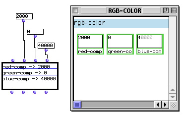
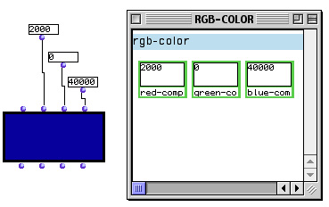

# OM Class protocol

Classes defined by the macros `defclass!` or `defclass*` have a set of methods for instance creation, visualisation and edition. For example if you define a class by:

```cl
  (defclass! rgb-color ()
    ((red-comp :initform 0 :initarg :red-comp :accessor red-comp)
     (green-comp :initform 0 :initarg :green-comp :accessor green-comp)
     (blue-comp :initform 0 :initarg :blue-comp :accessor blue-comp))
    (:documentation "color with components red, blue and green.")
    (:icon 179))
```
A factory and an editor are associated to the class by default.



To change the "miniview" appearance you need only to subclass the mehod `draw-obj-in-rect`:

```cl
  (defmethod draw-obj-in-rect ((self rgb-color) x x1 y y1 edparams view))
```

The _view_ parameter determine the view where the object is shown, _x_, _x1_, _y_, _y1_ specify a rectangle into the view. Some instances need some values for edition (i.e. font size, etc), you can use the _edparams_ parameter for this porpose.

For our example the next method definition:

```cl 
 (defmethod draw-obj-in-rect ((self rgb-color) x x1 y y1 edparams view)
    (declare (ignore edparams view))
    (om-with-fg-color self (om-make-color (red-comp self) (green-comp self) (blue-comp self))
      (om-fill-rect x y x1 y1)))
```

shows the rgb-color instance as a color (!!!)




## Writing an editor

You can define a subclass of **omboxeditcall**, for example :</P>

```cl
  (defclass colorfactory (omboxeditcall) ())
```

To associate the new box class with the `rgb-color` class using the next method:


```cl
  (defmethod get-type-of-ed-box ((self rgb-color)) colorfactory)
```

..and redefine methods of `OMBoxEditCall`.


Double-click on a factory call the `OpenEditorFrame` method with the factory as argument. If there is not an editor for the class the default editor is open. In order to write an editor we start to define the method `class-has-editor-p`.


```cl
  (defmethod Class-has-editor-p ((self rgb-color)) t)
```


The next method associate the editor's class name with the class edited:

```cl
  (defmethod get-editor-class ((self rgb-color)) 'colorEditor)
```

Finally we define the editor class which is a subclass of `EditorView`:


```cl
  (defclass colorEditor (EditorView) ())
```


## Temporal classes


You can not put `rgb-color` instances in a maquette because they are not temporal objects, if you want the instances of your class to be temporal objects your class must inherit from the `simple-container` or the `container` classes:


```cl
  (defclass! rgb-color (simple-container)
    ((red-comp :initform 0 :initarg :red-comp :accessor red-comp)
     (green-comp :initform 0 :initarg :green-comp :accessor green-comp)
     (blue-comp :initform 0 :initarg :blue-comp :accessor blue-comp))
    (:documentation "color with componenents red, blue and green.")
    (:icon 179))
```

