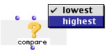
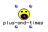

# Writing Code for OM

This page explains how to write textual code for OM. 


## Using your Lisp Code

Code writen in ANSI Common Lisp (CLOS) can easily be used in OM; to do that, you need only to load the code that you want to use. Once the code is loaded, you can use all functions defined in the code, as boxes in a patch (command-click-drag on a patch and type the function's name). Function's documentation and argument's names are nicely shown in the box. In addition to functions, you can also create boxes referring to methods and macros.

For OM 5.0 and higher, however, a cross-platform API is defined in the _om-api_ sources sub-folder, allowing OM code to run on different supported platforms.


## Packages

More than to create boxes calling any lisp function you can also choose some functions in order to create an interface to your code. You may organize your functions in an existant OM package or create a new one. The next expression creates a new package and stores it in a global variable :

```cl
(defvar *myNewPackage* (omng-make-new-package package-name))
```

Now you can add your selected functions or methods to the package using the function `AddLispFun2Pack`. Here is an exemple :

```cl
(AddLispFun2Pack 'fun1 *myNewPackage*) 
(AddLispFun2Pack '(fun1 fun2 fun3 fun4) *myNewPackage*)
```

In order to visualize your new package you must attach it to another one already visualized; for this purpose use the function `AddPackage2Pack`.

```cl
(AddPackage2Pack new-subpackage receiving-package)
```

You should add your personal packages to the standard package `*om-package-tree*` (This is the root of the package tree).


## OM Class definition

Use the macro `defclass!` to define a class in OM.

```cl
defclass! classname ({superclassname}*) ({slot-specifier}*) [[class-option]]
```

For example the next expression defines an OMClass named `tonal-note` which inherits from the class `note` and contains one slot named `tonality`.

```cl
(defclass! tonal-note (note) 
   ((tonality :initform '(C Major) :initarg :tonality :accessor tonality))
  (:icon 129))
```

You can turn any existing CLOS class into an OM class by changing `defclass` into `defclass!` in its definition.

Syntax of `defclass!` is close to the CLOS syntax of `defclass`, you must however respect some conditions :

* All slots must define the :initform and the `:accessor` options.
* If you define the `:initarg` option the slot is showed as an input in factory boxes else it is hidden.
* If you use the class-option `:metaclass` the metaclass must be a sub-class of `omstandardclass`.

A new class-option `:icon` was added in order to define the icon Id associated to the new class.
If you do not use it, a default icon Id is associated to the new class.

You can store an OM class in a package using the function `AddClass2Pack`.

```cl
(AddClass2Pack classname package) (AddClass2Pack '(classname1 ... classname2) package '(pos1 ... posn))
```

If you add a class A inheriting from B to a package and B is not belonging to the package OM create an alias of B into the package. This can be seen in the class hierarchy view of the package (double-click on the upper half of the package suitcase to get into this view). For this reason, please add the superclasses before the subclasses to the package.

The optional argument _'(pos1 ... posn)_ is a list of x,y cordinates for the position of the new class icon in the class hierarchy window. _posi_ must be given in the format of an OM point (e.g. `(om-make-point 10 10)`).


## OM Method definition

Use the macro `defmethod!` to define an OM method.

```cl
defmethod! methodname {method-qualifier}* lambda-list [[{genfun-option}*]] {form}*
```

For example the next expression defines an OMMethod named `is-major?` specialized for a class `tonal-note`.

```cl
(defmethod! is-major? ((self tonal-note)) 
   :doc "tells if the associated tonality of the note is major" 
   :icon 193 
   (eq (second (tonality self)) 'Major))
```   

You can turn any existing CLOS methods into an OM methods by changing `defmethod` into `defmethod!` in its definition.

Syntax of `defmethod!` is close to the CLOS syntax of `defmethod`. This is the list of the genfun-options :

* `:icon` defines an icon Id for the function.
* `:initvals` a list with a default value for each input.
* `:indoc` a list with a documentation string for each input.
* `:numouts` tells how many outputs the function has
* `:doc` documentation of the function
* `:menuins` defines a pop-up menu attached to a parameter of thefunction

Remember that a set of methods with the same name defines really a generic function in CLOS. This is why the genfun-options refer to the word function.

The next example defines a method (a generic function if it is not yet defined) using some genfun-options.

```cl
(defmethod! compare ((note1 note) (note2 note) lowest) 
   :icon 180 
   :initvals (list (make-instance 'note) (make-instance 'note) T) 
   :indoc '("a note" "a note" "Menu") 
   :doc "compares the pitch of 2 notes, and yields the lowest (or the highest) one" 
   :menuins '( (2 ( ("lowest" T) ("highest" NIL)))) 
   (if lowest 
     (if (<= (midic note1) (midic note2)) note1 note2) 
    (if (>= (midic note1) (midic note2)) note1 note2)
   )
 )
```



`:menuins '( (2 ( ("lowest" T) ("highest" NIL)))) says that the third input (_lowest_) has a pop-up menu associated. This menu has 2 menu items called "_lowest_" and "_highest_", they return as value, when they are selected by the user, the values T and NIL. A box corresponding to this generic function is showed in the figure :

All the genfun-options must be given when the first method associated with a given generic function is defined. They must not be given for subsequent method definition for the same generic function. (they will be ignored in that case).

If you use the genfun-option `:numouts` your code must return consistent multiple _values_ using the values construction. For example:

```cl
(defmethod! plus-and-times ((a integer) (b integer)) 
  :doc "Return 2 values : a+b and a*b." 
  :numouts 2 
  (values (+ a b) (* a b)))
```



`:initvals` and `:indocs` options are optionals, but if you give a value the length of the list must be equal to the number of parameters else the difference of parameters will be ignored.


> **Methods cannot be directly added to a package, but generic functions do (see next section).**

## OM Generic function definition

Use the macro `defgeneric!` to define a generic function in OM.

```cl
defgeneric! functionname lambda-list [[({genfun-option})*]]
```

For example, the next expression defines an OMGenericFunction named _Period_.

```cl
(defgeneric! period (self) 
  (:documentation "Cacul the period of <self>, i.e.. its duration." ) 
  (:icon 193))
```

[You can use the options `:documentation` and `:method-combination`, but not `:method-class` and `:generic-function-class`. In order to change these last meta-object classes, modify the meta-objects-class variables.]

Since `defgeneric!` is close to `defgeneric` you change generic functions definition in CLOS to OMGenericFunctions by adding the char '!'.


> **Note:** A generic function is automatically defined at defining a method for the first time (using `defmethod` or `defmethod!`), so the use of `degeneric!` is generally not mandatory.


You can store an OMGenericFunction in a package using the function `AddGenFun2Pack`.

```cl
(AddGenFun2Pack funname package) 
(AddGenFun2Pack '(funname1 ... funname2) package)
```


