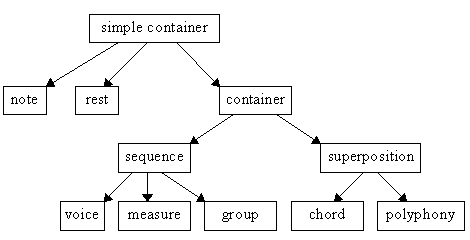
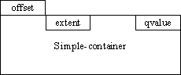
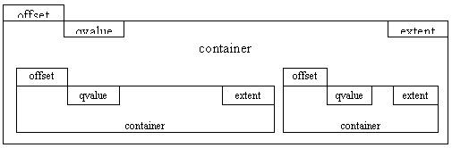
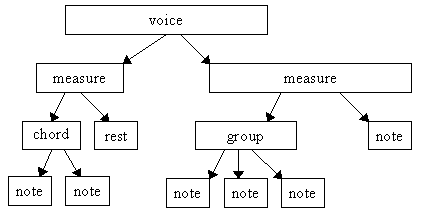
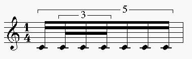
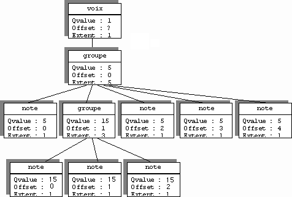
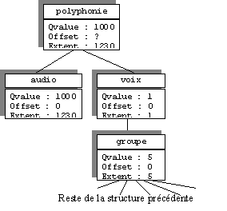

# Containers and simple containers

In OM, every musical object is an instance of some subclass of either `simple-container` (atomic objects) or `container` (compound object).


This is the (partial) inheritance tree starting at `simple-container`:



.. and this is the class definitions:

```cl
  (defclas simple-container ()
    ((parent :initform nil)
     (Qvalue :initform 1)
     (QTempo :initform 60)
     (offset :initform 0)
     (extent :initform 1)))
	
  (defclas container (simple-container)
    ((inside :initform nil)))
```

The slot `inside` in a `container` stores a list of sub-containers that are either instances of `container` (nodes of the container tree) or `simple-container` (leaves of the container tree).

These sub-containers are positioned and dimensioned in time.

All the slots that give the time specification (`QValue`, `Qtempo`, `offset`, `extent`) are defined in the class `simple-container` (remember that a `container` is also a `simple-container`).

Subcontainers are really sub-trees of the container tree. They define a local time scale, in the following way:


  * **qvalue** is an integer, such that 1 / _qvalue_ defines a rational fraction of the quarter note.     
  This is the abstract time unit in which the _extent_ is expressed
  * **qtempo** is an integer. Defines a tempo expressed as a frequency of the quarter note per minute (e.g. q.n. = 60).    
  Gives an interpretation of _Qvalue_ in the physical time.
  * **offset** is an integer.     
  Time offset of the container from the beginning of its super-container. _offset_ is expressed in the time scale defined by the _qvalue_ slot of the super-container.
  * **extent** is an integer. Expresses the duration of the container, in the time scale defined by the _qvalue_.


The following pictures show the container tree-structure. The slots `offset`, `qvalue` and `extent` are drawn inside or outside the container rectangle, depending on the time scale in which they are expressed.






Using the _qvalue_ mechanism, a local time scale can be defined at each level of the container tree. This helps maintaining complex container structures where some parts could belong to score level time scales while other could belong to audio level time scales, while still restraining to integer computation. Restraining to integer computation is very important for rhythm quantization issues.


Here is an example where we use some musical subclasses of `container` and `simple-container`:


_Voice_ is a subclass of `container`. It defines a musical voice in a score. Its `inside` slot is a list of _measures_, another `container`.
The `inside` slot of _measures_ are either single _notes_ (`simple-container`), _chords_ or _groups_ (`container`). _Groups_ are groups of chords or notes that belong to a beat (e.g. three chords making a triplet).

The next picture shows the instantiation tree starting from _voice_. The arrows express the inside` slot of the object they start from.




Here is an example of a measure:



... and the instantiation tree showing the values for _qvalue_, _offset_ and _extent_ slots



Here is another example where we superpose the previous _voice_ and an _audio file_ which lasts 1230 ms.



