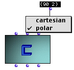

# Box evaluation

When you make option-click on one outlet of a box (or press 'v' after selecting this box), the generic `omNG-box-value` is called. Code for the most general method is:

```cl
  (defmethod! omNG-box-value ((self OMBoxcall) &amp;optional (numout 0))
    (cond
      ; if the box is in lambda mode
      ((equal (allow-lock self) "l") (special-lambda-value self (reference self)))
      ; if the box is in reference mode
      ((equal (allow-lock self) "o") (fdefinition (reference self)))
      ; if the box is locked
      ((and (equal (allow-lock self) "x") (value self)) (nth numout (value self)))
      ; if the box is in eval-once mode 
      ((and (equal (allow-lock self) "&") (ev-once-p self)) (nth numout (value self)))
      ; if there is no button, we eval normal and keyword inlets in the box
      (t (let* ((args (loop for input in (inputs self) when (not (keyword-input-p input)) 
	                        collect (omNG-box-value input)))
                (args (list+ args (eval-keywords self)))
                ; then we look for the aplicable method for these arguments
                (themethod (compute-applicable-methods (fdefinition (reference self)) args)) 
                rep)
              (if (null themethod)
                  (progn (om-dialog-message (string+ &quot;no method is defined for inputs in box &quot; (name self)))
                         (abort))
             ; If there is a method we test if this is a graphic method 
             ; and if it is not compiled if it is the case we compile it.
                  (progn
                     (when (and (EditorFrame (car themethod)) (not (compiled? (car themethod))))
                        (modify-genfun (EditorFrame (car themethod))))
                     ; Call the method with the evaluated inlets, multiple results are allowed
                     (if (equal (class-name (class-of self)) 'OMBoxcall)
                         (setf rep (multiple-value-list (apply (reference self) args)))
                         (setf rep (multiple-value-list (special-value self args))))))
           ; If the box is locked or it is in eval once mode the result is kept in the slot value
           (when (equal (allow-lock self) &quot;&amp;&quot;)
             (setf (ev-once-p self) t)
             (setf (value self) rep))
           (when (equal (allow-lock self) &quot;x&quot;)
             (setf (value self) rep))
           ; finally we return the numout output of the evaluation.
           (nth numout rep))))))
```

<br>
--------

Sometimes this mechanism do not work right, for example suppose us that we want to define a box **OMWhen** equivalent to the lisp macro ''WHEN'':

```cl
  (defmethod! OMWhen (test &amp;rest actions)
    (when test (car (last actions))))
```

The problem is that we do not want to eval parameters 'actions' if 'test' is NULL...

The solution is to define a subclass of `OMBoxCall` and redefine the `omng-box-value` for the new class.

```cl
  (defclass WHENboxCall (OMBoxcall) ())
```

In order to say that the box class for the method `OMWhen` is `WhenBoxcall` and not `OMBoxCall`, we must redefine the method, `get-boxcallclass-fun`:

```cl
  (defmethod get-boxcallclass-fun ((self (eql 'OMWhen))) 'WHENboxCall)
```

Now we can redefine the `omNG-box-value`, for example:


```cl
  (defmethod omNG-box-value ((self WHENboxcall) &amp;optional (numout 0))
    (declare (ignore numout))
    (cond
      ((equal (allow-lock self) "l") (special-lambda-value self 'omWhen))
      ((and (equal (allow-lock self) "x") (value self)) (value self))
      ((and (equal (allow-lock self) "&") (ev-once-p self)) (value self))
      (t (let ((rep (omNG-box-value (first (inputs self)))))
           (when rep
             (loop for item in (cdr (inputs self)) do
                (setf rep (omNG-box-value item)))) 
           (when (equal (allow-lock self) &quot;&amp;&quot;)
              (setf (ev-once-p self) t)
              (setf (value self) rep))
           (when (equal (allow-lock self) &quot;x&quot;)
              (setf (value self) rep))
            rep))))
```


Evaluating a patch box (`omboxpatch`) calls a generated code from the boxes in the patch. The code from a box is generated by the generic function gen-code. The most general method is the following:


```cl
(defmethod gen-code ((self OMBoxcall) numout)
  (cond
    ; if the box is in lambda mode
    ((equal (allow-lock self) &quot;&amp;&quot;) (gen-code-for-ev-once self numout))
    ; if the box is locked
    ((equal (allow-lock self) &quot;x&quot;) `(nth ,numout ,(gen-code (value self) 0)))
    ; if the box is in reference mode
    ((equal (allow-lock self) &quot;o&quot;) ',(reference self))
    ; if the box is in eval-once mode
    ((equal (allow-lock self) &quot;l&quot;) (curry-lambda-code self (reference self)))
    ; if there is no button
    (t (call-gen-code self numout))))
```

For the **OMWhen** example we define:

```cl
  (defmethod call-gen-code ((self WHENboxcall) numout)
    (when ,(gen-code (first (inputs self)) 0)
       ,.(loop for item in (cdr (inputs self))
               collect (gen-code item 0))))
 ```

You can redefine other mechanisms for a box, for example add and remove inputs are made by functions `do-add-one-input` and `do-remove-one-input`, respectively. See the source code for more information. A particular type or boxes are factories, we give an example of sub-classing factories in the next section.


## Factory boxes

In the same way as normal boxes, you can create a subclass of `OMBoxEditCall` (the class of factories) and redefine methods for the new class, for example suppose that we have a OMStandardClass defined by:


```cl
  (defclass! 2DPoint ()
    ((x-coor :initform 0 :initarg :x-coor :accessor x-coor)
     (y-coor :initform 0 :initarg :y-coor :accessor y-coor)))
```

We define also a new class of factory:


```cl
  (defclass 2DPointFactory (omboxeditcall) ())
```

In order to say that the factory class for a `2DPoint` is `2DPointFactory` and not `OMBoxEditCall`, we must redefine the method `get-type-of-ed-box`:

```cl
  (defmethod get-type-of-ed-box ((self 2DPoint)) '2DPointFactory)
```

Now you can redefine `OMNG-Box-Value` and `gen-code` for the new class.


Inputs of factories match with each slot in the class, but sometimes it can not be desirable. For example if we want to make `2DPoint` instances switching between angular and Cartesian points, we need an inlet with a menu ('cartesian' / 'polar' mode) and an inlet with a list of 2 coordinates.



For this purpose we start redefining the method `get-slot-in-out-names`:


```cl
  (defmethod get-slot-in-out-names ((self 2DPoint))
    (values '("self" "mode" "values")
            '(nil c '(0 0))
            '("object or object list" "polar or cartesien mode" "parameters")
            '(nil (( 1 (("cartesian" c) ("polar" p)))) nil)))
```

This function return four values:
  * A list of the input names
  * A list with the default values
  * A list with the input docs
  * A list for menu inputs (if nil the input is normal)

Because we have changed the inputs we must change the instance builder, for this redefine also the method `cons-new-object:

```cl
  (defmethod cons-new-object ((self 2DPoint) args objs)
    (if objs
      ; If the first input is connected call the coerce function objfromobjs
      (objFromObjs (first args) self)
      ; Else make an instance with initargs list args
      (let ((mode (second args))
             x y)
	  ; The menu input is in cartesian mode
         (if (string-equal mode 'c)
             (setf x (first (third args))
                   y (second (third args)))
             ; The menu is in polar mode
             (setf x (* (sin (first (third args))) (second (third args)))
                   y (* (cos (first (third args))) (second (third args)))))
	     ; make the instance
         (apply 'make-one-instance (list self x y)))))
  ```