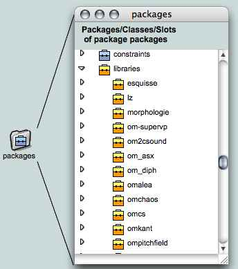
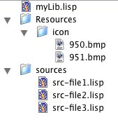
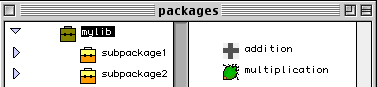

# Writing User Libraries


We show in this page the way to write user libraries for OM. Section [Writing code for OM](codeforOM) may be necessary to understand this text. Libraries are specialized set of classes and methods written in Common-Lisp and loaded dynamically in OM.

Here you can download a template user-defined library:  <https://github.com/openmusic-project/my-lib> 

Unzip this file if you want to try to load it in OM and/or to use it as a template for writing a new library.

> GitHub-project downloads append the name of the branch to the folder name ("my-lib-masyer"): rename it "my-lib" to comply with the following requirements. 

## Loading Libraries in OM

All the registered OM libraries are acessible from the _Library_ window.



Load one libray by double-clicking the bottom part of the lib icon, or by right-clicking/control-clicking on it and choosing "Open/Load Library" in the contextual menu.

The library classes and functions will then be available in the same window, or from the general patch menus "classes" and "Functions" under "User Libraries".

There are several ways of loading a library in OM.

* Put the library folder in the external user lib directory (specified in OM preferences). The library will be automatically loaded in the OM packages (OM 6.0.3 and higher).
* Let it anywhere on your computer and load it dynamically after starting OM using the menu //File/New Remote Library...// of the library window (OM 5.1 and higher).
* Put the library folder in _OM/UserLibrary/_ **before to start OM**. The library will be automatically added in the OM packages.


## The Library Folder

A user library is directory that contains source code and resources needed to build a library in OM.
This directory must respect some constraints :



* The library's name is defined by the sub-string until the first space in the name of the folder.     
For exemple a folder named "myLib 1.5" defines the library _myLib_.      
If you have 3 folders named "myLib", "myLib 1.0" and "myLib xxx y zzz" in the library folder(s), for OM, you have 3 versions of a same library called "mylib".

* A library is generally organized as follows :
  * **MyLib.lisp** is the file loaded when you load the library.
  * **resources** is the folder that contains the resources of the library. Principally, it contains a subfolder called "icon" in which the icons of the library are stored.
  * **sources** a folder that contains the source code of the library.
  * **online** a folder that contains tutorial patches for the objects of the library.
  * **examples** is a folder containing example/tutorial patches dynamically loadable in OM.

> **MyLib.lisp** is the only necessary element. The other ones are optionals.     
Note that the file is called "MyLib.lisp" and not "MyLib 1.0.lisp".


## Loading the Code

When you load a library from OM, the file **MyLib.lisp** is loaded. It should contain the instructions for loading the rest of the library source code.

Here is an example of how to proceed with a sample library: 

```cl
(defvar *MyLib-files* nil)

(setf *MyLib-files* 
  (list
    (make-pathname :directory (append (pathname-directory *load-pathname*) (list "sources")) :name "src-file1")		
    (make-pathname :directory (append (pathname-directory *load-pathname*) (list "sources")) :name "src-file2")	
    (make-pathname :directory (append (pathname-directory *load-pathname*) (list "sources")) :name "src-file3")	
))

(mapc #'compile&load *MyLib-files*)
```

`*load-pathname*` is a global variable that records the path of the file being loaded. In our case, this is the path to our **MyLib.lisp** file, hence to our library folder.

We use this path in order to build the other pathnames to be loaded (in this case _[...]/MyLib/sources/src-file1.lisp_, etc.)

`compile&load` compiles the corresponding Lisp files if needed and load the .cfsl (or .\*fasl) compiled files.


## Sub-Packages

The classes and functions defined in the library can then be organized in sub-packages of this library.


When a library is loaded, the variable `*current-lib*` is set to this library.


You can use functions `omng-make-new-package`, `AddPackage2Pack`, `AddClass2Pack`, `AddLispFun2Pack`, `AddGenFun2Pack` (detailed in [Writing code for OM](codeforom)) for setting your library package architecture.


There exists a function `fill-library` that creates and fill the subpackages from a list of the form _(sub-pack-name subpack-lists class-list function-list class-alias-list)_

For example:

```cl
(om::fill-library '(
	("SubPackage1" nil nil (Addition) nil)
        ("SubPackage2" nil nil (Multiplication) nil)
))
```

... creates 2 sub-packages and and place the functions addition and multiplication in it.




## Icons

Icons are bitmap files (currently supported formats: tif, bmp, png, jpg...) to be put in the _MyLib/resources/icon/_ directory. The file name must be a number which will correspond to the icon identifier in OM.

Icon identifiers in a library can be used only for the library.

For example, if a file called "176.tif" representing this icon :  is in _MyLib/resources/icon/_, then  when you define the function "multiplication":

```cl
(defmethod! Multiplication ((self number) (arg number))
	:initvals '( 10 10 )
	:indoc '("First operand" "Second operand")
	:icon 176
	:doc "Multiply 2 things. Things can be numbers, lists, chords."
	(* self arg) )
```

... the icon is  and not  that is the correponding icon for 176 in OM.

If you want to use an icon defined in the OM resources use a list with the iconID, for example:


```cl
(defmethod! Addition ((self number) (arg number))
	:initvals '( 10 10 )
	:indoc '("First operand" "Second operand")
	:icon '(176)
	:doc "Adds 2 things. Things can be numbers, lists, chords."
	(+ self arg) )
```

## Dependencies

If your library needs to load other libraries use the function `require-library`.


```cl
(require-library "OMAlea")
```

## Example patches and in line tutorials


Your library may contain some example patches or in line tutorials for the objects (functions, classes) it contains. 

Example patches can be loaded from OM using the "Help/Import Tutorials" menu.
Just put patches in a directory called "examples" in the library folder.

In line tutorial patches are opened by selecting an object in a patch and pressing 'T' key.
Create a patch with the same name as your function or class and put it in in a directory called "inline" in the library folder.
