# Overview

OpenMusic is a full-featured visual programming environment, providing most of the programming constructs of Common Lisp (abstraction, higher-order functions, conditionnals, loops, lists management, etc.). Musical objects and structures (chords, chords sequences, rtythms, break-point functions, sounds) can be created thanks to a set of classes and manipulated with specialized functions.

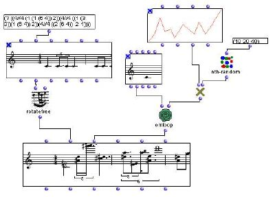

**Musical Editors** are a fundamental aspect in the OM programming workflow. They allow users/programmers to store, visualize (or listen) and edit the results or intermediate data structures involved in the programs.\\
Harmonic features allow for the representation of tonal properties in musical objects.

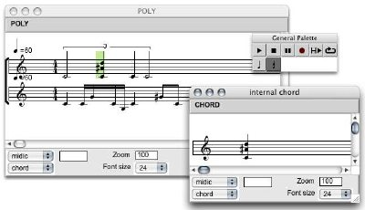
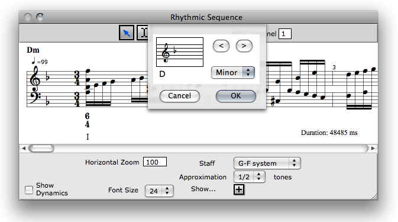

### Object Oriented Programming

User-defined classes can be created and connected to the OM class hierarchy. Generic functions and specializing methods can be defined by visual programs.

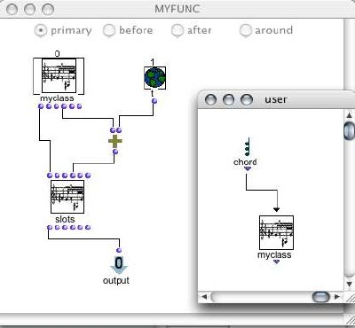

### Time Structures

The _maquette_ is an original sequencing/programming interface where musical objects can be organized and connected in a temporal context.

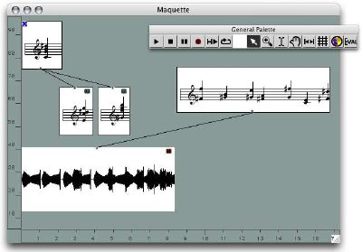

### Musical data/format processing:

Representation and manipulation of music and sound description data in MIDI, Audio, SDIF, OSC format.

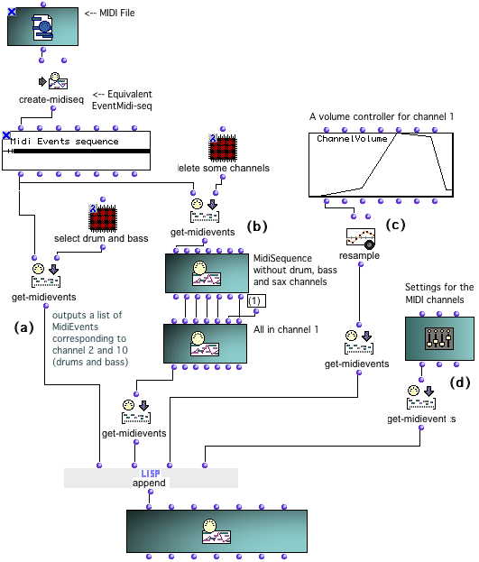
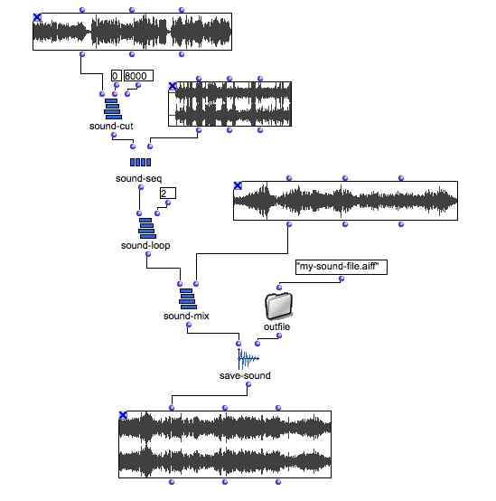
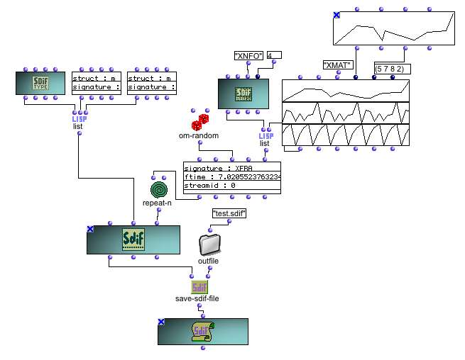

### Music analysis:

MathTools is a dedicatyed set of mathematical tools for computer-assisted music analysis.

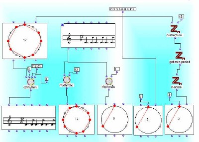

### Sound processing/synthesis/spatialization libraries:

A set of external libraries allow to control external sound analysis, processing, or synthesis tools (see [Libaries](libraries).

3D objects and other dedicated external libraries allow to control the spatialization of sounds using numerous advanced techniques.

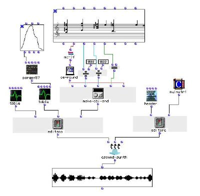
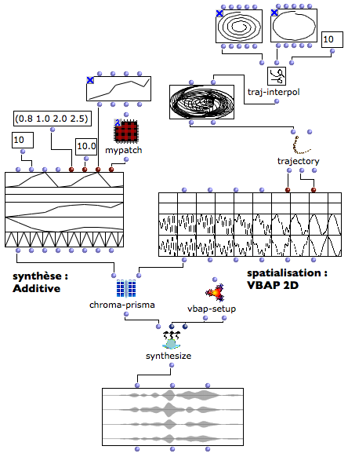
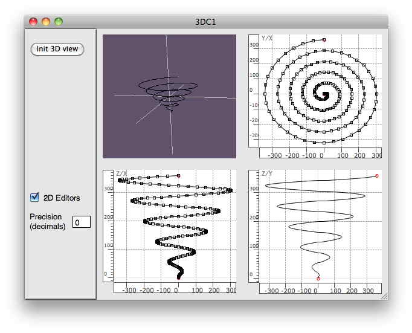

